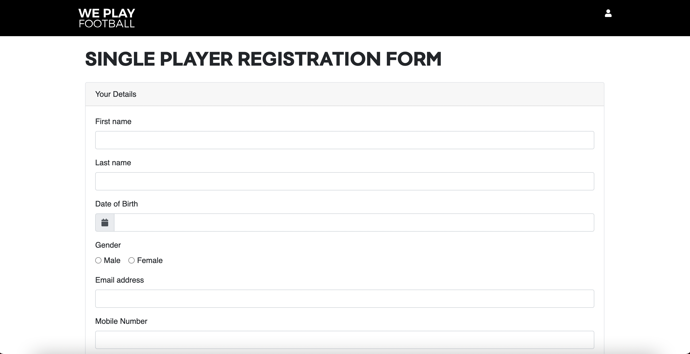
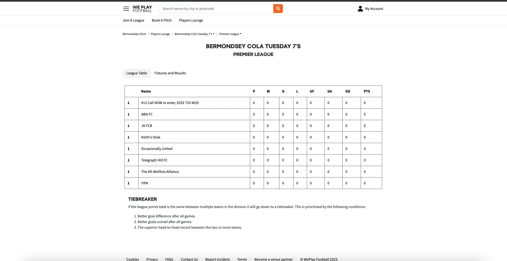
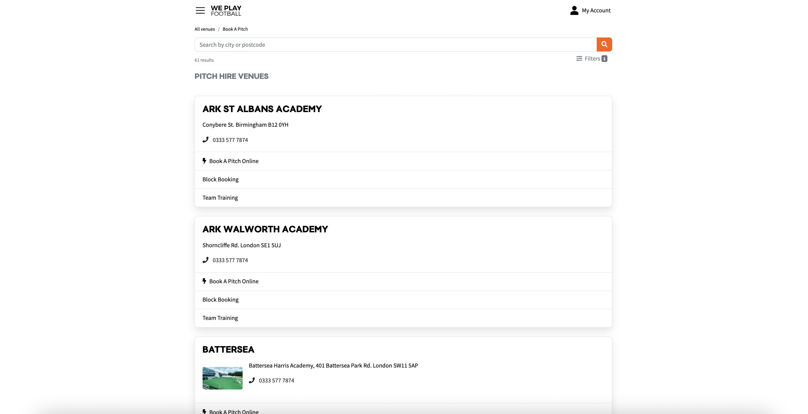
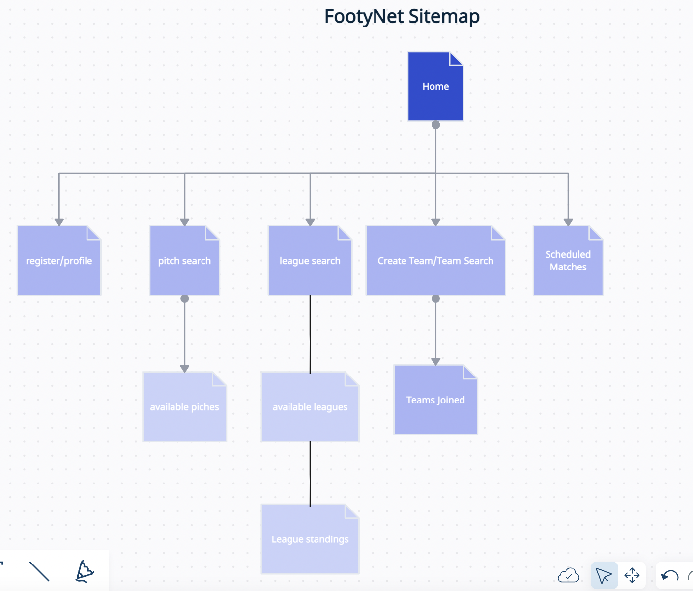

The content below is an example project proposal / requirements document. Replace the text below the lines marked "__TODO__" with details specific to your project. Remove the "TODO" lines.

# FootyNet

## Overview

The soccer booking platform is a web application that allows users to set up soccer games, tournaments, and leagues between teams, find available pitches in their area, and connect with other players. Users can join teams that need extra players, create their own teams, and schedule matches with other teams. The application will be built using Express and MongoDB and will include several forms, mongoose schemas, and routes.

## Data Model

* The following documents will be stored in the database:

  * User: Stores information about registered users, including their name, email, password, and team affiliation.
  * Team: Stores information about each team, including the team name, captain, and players.
  * Pitch: Stores information about available pitches, including the location, availability, and price.
  * Match: Stores information about scheduled matches, including the teams, pitch, date, and time.
  * League: Stores information about ongoing leagues, including the teams, schedule, and standings.

Example User:
```javascript
{
  name: "John Doe",
  email: "john.doe@example.com",
  password: "hashed_password", // a password hash
  team: "605c72ef4a16294268910e4c" // ObjectId of a Team document
}
```

Example Team:
```javascript
{
  name: "Soccer Stars",
  captain: "605c72ef4a16294268910e4b", // ObjectId of a User document
  players: [
    "605c72ef4a16294268910e4b", // ObjectId of a User document
    "605c72ef4a16294268910e4c", // ObjectId of a User document
  ],
  matches: [
    "605c72ef4a16294268910e4d", // ObjectId of a Match document
  ]
}
```
Example Pitch:
```javascript
{
  location: "Green Park Soccer Field",
  availability: ["2023-04-15T10:00:00.000Z", "2023-04-16T14:00:00.000Z"],
  price: 50
}
```
Example Match:
```javascript
{
  teams: [
    "605c72ef4a16294268910e4e", // ObjectId of a Team document
    "605c72ef4a16294268910e4f", // ObjectId of a Team document
  ],
  pitch: "605c72ef4a16294268910e50", // ObjectId of a Pitch document
  date: "2023-04-15T10:00:00.000Z",
  time: "10:00"
}
```

Example League:
```javascript
{
  name: "Spring Soccer League",
  teams: [
    "605c72ef4a16294268910e4e", // ObjectId of a Team document
    "605c72ef4a16294268910e4f", // ObjectId of a Team document
  ],
  schedule: [
    "605c72ef4a16294268910e51", // ObjectId of a Match document
    "605c72ef4a16294268910e52", // ObjectId of a Match document
  ],
  standings: [
    {
      team: "605c72ef4a16294268910e4e", // ObjectId of a Team document
      points: 6,
    },
    {
      team: "605c72ef4a16294268910e4f", // ObjectId of a Team document
      points: 4,
    },
  ]
}
```

## [Link to Commented First Draft Schema](db.mjs) 

## Wireframes

/home - user chooses to book a pitch, join league, register etc..


/register - allows user to register a new profile



/leagues - page to show league standings



/pitches - page to show available pitches for user to book




## Site map




## User Stories or Use Cases

1. As a non-registered user, I can register a new account with the site.
2. As a user, I can log in to the site.
3. As a user, I can create a new soccer team.
4. As a user, I can view all the soccer teams I'm part of or managing in a single list.
5. As a user, I can invite players to join my team.
6. As a user, I can search for available pitches in my area.
7. As a user, I can book a pitch for a soccer match.
8. As a user, I can schedule a match between my team and another team.
9. As a user, I can view the schedule of upcoming matches for my team.
10. As a user, I can join or leave a soccer team.
11. As a user, I can create a new league or tournament.
12. As a user, I can join an existing league or tournament with my team.
13. As a user, I can view the standings and match results of the leagues or tournaments I'm participating in.
14. As a user, I can update the match scores and outcomes for the matches I'm involved in.
15. As a user, I can view and edit my profile, including my name, email, and team affiliation.

## Research Topics

* (5 points) Integrate user authentication

  * Use Passport.js for user authentication.
  * Create test accounts for demonstration purposes.
  * See /register for the registration page.
  * See /login for the login page.
  
* (4 points) Implement real-time pitch availability

  * Use Socket.io to provide real-time updates on pitch availability.
  * Enable users to see when a pitch becomes available or is booked by another user.
  * See /pitches for the list of available pitches.
  
* (2 points) Geolocation and nearby pitch search

  Integrate the Google Maps API to search for nearby pitches based on user location.
  Allow users to filter search results by distance, availability, and price.
  See /search for the pitch search page.
 
* (4 points) Implement match scheduling and notifications

  * Create a match scheduling feature that allows users to choose a date, time, and location for a match.
  * Notify team members of upcoming matches via email or in-app notifications.
  * See /matches for the list of scheduled matches.
  
* (5 points) React.js

  * Use React.js as the front-end framework; it's a challenging library to learn, so I've assigned it 5 points.


## [Link to Initial Main Project File](app.mjs) 

## Annotations / References Used

1. Passport.js Authentication Docs - (add link to source code that was based on this)
2. Mongoose Documentation - (add link to source code that was based on this)
3. Express.js Documentation - (add link to source code that was based on this)
4. React.js Tutorial - (add link to source code that was based on this)
5. Socket.io Documentation - (add link to source code that was based on this)
6. Google Maps JavaScript API Tutorial - (add link to source code that was based on this)
7. NodeMailer Documentation - (add link to source code that was based on this)
8. CSS-Tricks article on client-side form validation - (add link to source code that was based on this)

